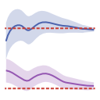

# OptimalDesign.jl

[](https://github.com/waudbylab/OptimalDesign.jl/actions/workflows/CI.yml)
[](https://codecov.io/gh/waudbylab/OptimalDesign.jl)
[](https://waudbylab.github.io/OptimalDesign.jl/stable/)
[](https://waudbylab.github.io/OptimalDesign.jl/dev/)



**Adaptive and static Bayesian optimal experimental design for nonlinear models.**

OptimalDesign.jl helps you decide *where* and *how many times* to measure in order to learn model parameters as efficiently as possible. It works with any nonlinear model you can write as a Julia function, handles prior uncertainty via particle-based Bayesian averaging, and supports both pre-planned batch designs and fully adaptive sequential experiments.

## Features

- **Batch design** — compute an optimal allocation of measurements before acquiring any data
- **Adaptive design** — sequentially choose the next measurement based on what you've learned so far
- **Bayesian averaging** — designs are optimised across prior distributions (via [Distributions.jl](https://github.com/JuliaStats/Distributions.jl))
- **Multiple criteria** — D-optimal (overall precision), Ds-optimal (subset of parameters), A-optimal, E-optimal
- **Particle posterior** — inference with likelihood tempering and Liu-West resampling
- **Optimality verification** — via the Gateaux derivative and the General Equivalence Theorem
- **Built-in plotting** — credible bands, corner plots, design allocation, live dashboard

## Installation

```julia
using Pkg
Pkg.add(url="https://github.com/waudbylab/OptimalDesign.jl")
```

## Quick example

```julia
using OptimalDesign, ComponentArrays, Distributions

# Define model and design problem
model(θ, x) = θ.A * exp(-θ.k * x.t)

prob = DesignProblem(
    model,
    parameters = (A = LogUniform(0.1, 10), k = Uniform(1, 50)),
    transformation = select(:k),
    sigma = Returns(0.1),
)

# Compute optimal design
candidates = candidate_grid(t = range(0.001, 0.5, length = 200))
prior = Particles(prob, 1000)
ξ = design(prob, candidates, prior; n = 20)

# Run experiment (with simulated data)
θ_true = ComponentArray(A = 1.0, k = 25.0)
acquire(x) = model(θ_true, x) + 0.1 * randn()
result = run_batch(ξ, prob, prior, acquire)
```
